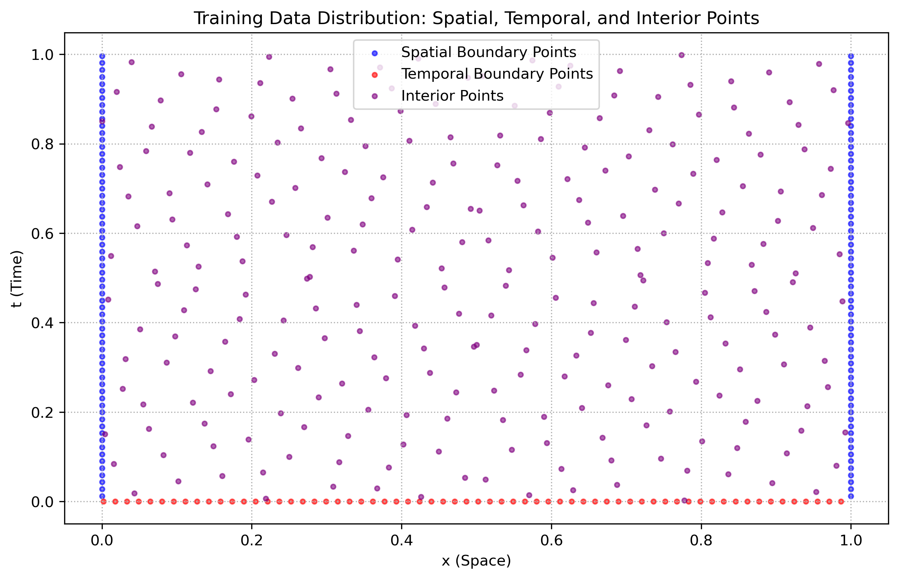
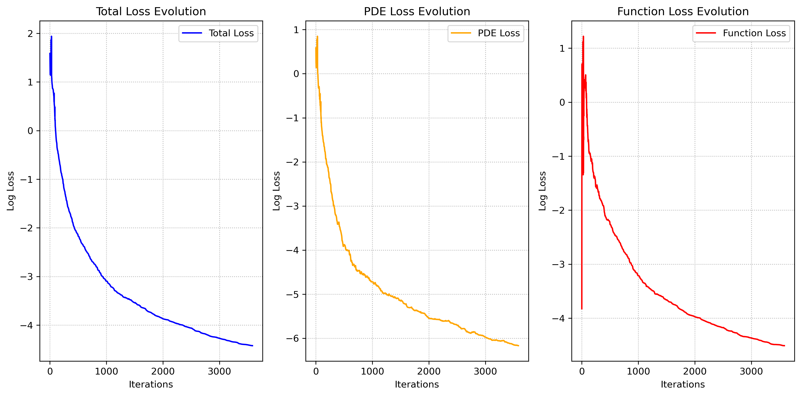
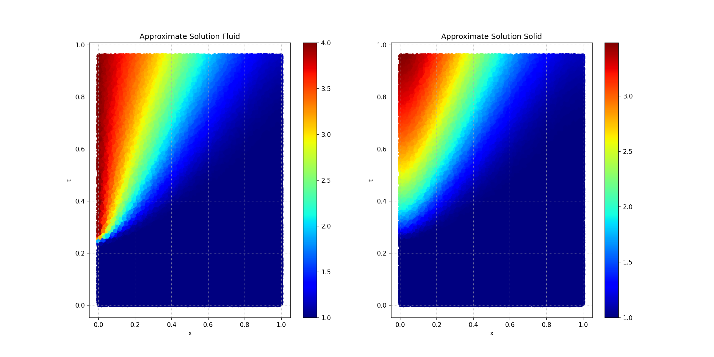

# Physics-Informed Neural Networks for Solving Coupled PDEs in Heat Transfer 

This project investigates the application of **Physics-Informed Neural Networks (PINNs)** to solve a coupled system of partial differential equations (PDEs) governing heat transfer between a **fluid** and a **solid**. The goal is to approximate the temperature distributions $T_f(x,t)$ and $T_s(x,t)$ for the fluid and solid, respectively, using a neural network that enforces both the governing PDEs and the associated boundary and initial conditions.  

Traditional numerical methods such as finite difference or finite element methods require meshing and explicit discretization of spatial and temporal domains. PINNs, however, embed the physics directly into the loss function and allow solutions without relying on explicit grids, making them advantageous in complex, high-dimensional problems.

## Governing Equations

We consider a **1D heat transfer problem** where the temperature distributions of a fluid and a solid are coupled through convective heat transfer. The governing equations are given by:

$$
\begin{aligned}
    \frac{\partial T_f}{\partial t} + u_f \frac{\partial T_f}{\partial x} &= \alpha_f \frac{\partial^2 T_f}{\partial x^2} - h_f (T_f - T_s) , \\
    \frac{\partial T_s}{\partial t} &= \alpha_s \frac{\partial^2 T_s}{\partial x^2} + h_s (T_f - T_s).
\end{aligned}
$$

where:  
- $T_f(x,t)$ and $T_s(x,t)$ represent the temperatures in the **fluid** and **solid**, respectively.  
- $u_f$ is the velocity of the fluid (assumed constant).  
- $\alpha_f$ and $\alpha_s$ are the thermal diffusivities of the fluid and solid.  
- $h_f$ and $h_s$ are heat transfer coefficients between the fluid and the solid.  

## Boundary and Initial Conditions
The system is subject to **Dirichlet** and **Neumann** boundary conditions:  

- **Initial Condition:**

$$
T_f(x,0) = T_s(x,0) = T_0
$$

for all $x$, where $T_0$ is the initial temperature.  

- **Boundary Conditions:**  

At $x = 0$ (fluid inlet), a **Dirichlet condition** is imposed:  

$$
T_f(0, t) = T_{\text{hot}}.
$$

At $x = L$ (solid-fluid interface), a **Neumann condition** is imposed:  

$$
\frac{\partial T_s}{\partial x} \Big|_{x=L} = 0.
$$

At $x = L$ for the fluid, heat flux continuity is enforced:  

$$
\frac{\partial T_f}{\partial x} \Big|_{x=L} = 0.
$$

  

## Neural Network Model

We approximate both **$T_f(x,t)$** and **$T_s(x,t)$** using a **single** neural network:  

$$
\mathcal{N}_\theta: (x,t) \mapsto [T_f(x,t), T_s(x,t)]
$$

where $\theta$ represents the neural network parameters (weights and biases).  

The model consists of:  
- **Input Layer:** $(x,t)$  
- **Hidden Layers:** Fully connected layers with SiLU activation.  
- **Output Layer:** $[T_f, T_s]$, representing temperature approximations.  

The network is trained to minimize a **physics-informed loss function**, ensuring that both the PDEs and the boundary/initial conditions are satisfied.

## Loss Function

The **total loss** is defined as: 

$$\mathcal{L} = \log_{10} \left( \lambda_u \mathcal{L}_u + \mathcal{L}_{\text{PDE}} \right)$$

where:  

**PDE Residual Loss** ensures that the neural network satisfies the governing equations:

$$
\mathcal{L}_{\text{PDE}} = \frac{1}{N_{\text{int}}} \sum_{i=1}^{N_{\text{int}}} \left| \mathcal{R}_f(x_i,t_i) \right|^2 + \left| \mathcal{R}_s(x_i,t_i) \right|^2.
$$

**Boundary and Initial Condition Loss** ensures physical constraints are met:

$$
\mathcal{L}_u = \frac{1}{N_{\text{b}}} \sum_{i=1}^{N_{\text{b}}} \left| T_f^{\text{pred}}(x_i, t_i) - T_f^{\text{true}}(x_i, t_i) \right|^2 + \left| T_s^{\text{pred}}(x_i, t_i) - T_s^{\text{true}}(x_i, t_i) \right|^2.
$$

$\lambda_u$ is a weighting factor to balance the importance of PDE residuals and boundary conditions.

## Training Strategy
- **Sampling Strategy:** Training points are generated using a **Sobol sequence**, ensuring an efficient and uniform coverage of the domain.  
- **Optimizer:** L-BFGS optimizer is used, which is well-suited for PINN training.  
- **Gradient Computation:** Automatic differentiation is used to compute spatial and temporal derivatives, enabling PDE residual evaluation.

## Training Metrics

  

## Predictions

The trained model provides accurate approximations for $T_f(x,t)$ and $T_s(x,t)$ within the domain.

  

